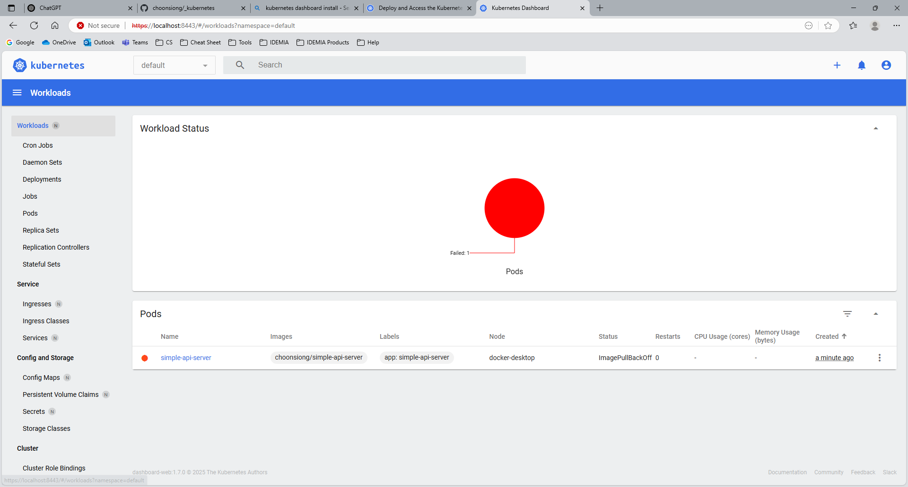

# Setup Kubernetes Dashboard on Windows

- Install helm
    - Download the executable file from [GitHub](https://github.com/helm/helm/releases)
- Run below commands:
  ```
  PS C:\Users\choonlee> helm.exe version
  version.BuildInfo{Version:"v3.18.4", GitCommit:"d80839cf37d860c8aa9a0503fe463278f26cd5e2", GitTreeState:"clean", GoVersion:"go1.24.4"}
  PS C:\Users\choonlee>
  PS C:\Users\choonlee>
  PS C:\Users\choonlee> helm.exe repo add kubernetes-dashboard https://kubernetes.github.io/dashboard/
  "kubernetes-dashboard" has been added to your repositories
  PS C:\Users\choonlee>
  PS C:\Users\choonlee> helm.exe upgrade --install kubernetes-dashboard kubernetes-dashboard/kubernetes-dashboard --create-namespace --namespace kubernetes-dashboard
  Release "kubernetes-dashboard" does not exist. Installing it now.
  NAME: kubernetes-dashboard
  LAST DEPLOYED: Sun Jul 13 19:17:09 2025
  NAMESPACE: kubernetes-dashboard
  STATUS: deployed
  REVISION: 1
  TEST SUITE: None
  NOTES:
  *************************************************************************************************
  *** PLEASE BE PATIENT: Kubernetes Dashboard may need a few minutes to get up and become ready ***
  *************************************************************************************************

  Congratulations! You have just installed Kubernetes Dashboard in your cluster.

  To access Dashboard run:
    kubectl -n kubernetes-dashboard port-forward svc/kubernetes-dashboard-kong-proxy 8443:443

  NOTE: In case port-forward command does not work, make sure that kong service name is correct.
        Check the services in Kubernetes Dashboard namespace using:
          kubectl -n kubernetes-dashboard get svc

  Dashboard will be available at:
    https://localhost:8443
  PS C:\Users\choonlee>
  PS C:\Users\choonlee>
  PS C:\Users\choonlee\Developers\_kubernetes\Kubernetes Dashboard>
  PS C:\Users\choonlee\Developers\_kubernetes\Kubernetes Dashboard> kubectl apply -f .\dashboard-adminuser.yaml
  serviceaccount/admin-user created
  clusterrolebinding.rbac.authorization.k8s.io/admin-user created
  PS C:\Users\choonlee\Developers\_kubernetes\Kubernetes Dashboard>
  PS C:\Users\choonlee\Developers\_kubernetes\Kubernetes Dashboard> kubectl -n kubernetes-dashboard create token
  error: exactly one NAME is required, got 0
  See 'kubectl create token -h' for help and examples
  PS C:\Users\choonlee\Developers\_kubernetes\Kubernetes Dashboard> kubectl -n kubernetes-dashboard create token admin-user
  eyJhbGciOiJSUzI1NiIsImtpZCI6IkJidS1lTkh0Y1U3MzJHc2dLdk5uZ0F1cXRZSUpZeDYxeUdKcmpWWW5IWjQifQ.eyJhdWQiOlsiaHR0cHM6Ly9rdWJlcm5ldGVzLmRlZmF1bHQuc3ZjLmNsdXN0ZXIubG9jYWwiXSwiZXhwIjoxNzUyNDA5MjQ1LCJpYXQiOjE3NTI0MDU2NDUsImlzcyI6Imh0dHBzOi8va3ViZXJuZXRlcy5kZWZhdWx0LnN2Yy5jbHVzdGVyLmxvY2FsIiwianRpIjoiYzYyYzIxMGQtNmU0ZS00NWVhLTkyZDUtNzM0ZDJhOWNjMTc4Iiwia3ViZXJuZXRlcy5pbyI6eyJuYW1lc3BhY2UiOiJrdWJlcm5ldGVzLWRhc2hib2FyZCIsInNlcnZpY2VhY2NvdW50Ijp7Im5hbWUiOiJhZG1pbi11c2VyIiwidWlkIjoiOWE2YjZhOWItZGM1MS00YTZjLWFkZjUtMzQxOTdmMjdiZDI0In19LCJuYmYiOjE3NTI0MDU2NDUsInN1YiI6InN5c3RlbTpzZXJ2aWNlYWNjb3VudDprdWJlcm5ldGVzLWRhc2hib2FyZDphZG1pbi11c2VyIn0.dDheKOdI5-yajnb_tpNcL0FOvAgOI5kbJG2A8KBxJjaWanpwqpyARR2mr1Z9-fX2wTJ79IxQbRrG2rOUyL_SC1aHPHukefRhIEFgvu6_ReVycZ5dn7e_626b03lyTikIaQIqHl6p6CacH69TV8cuJI1ZknY4MR_MLrzq1se_2TsHifJUXQKlnu08iiEJIThfktbtTbM163yXLTGBwP3nn8RObUh6AW-nXaqrAVtUeILFqRbr29N_kzSPB0G69wJbbBX4LTsftXCK8J3WjluN4XORKIgbR9oDczbzzn29c7wlGKwtxiSCJPTbSZ01LXQOGxdAhmcEFMW4N9N0Jo_iWg
  PS C:\Users\choonlee\Developers\_kubernetes\Kubernetes Dashboard>
  PS C:\Users\choonlee\Developers\_kubernetes\Kubernetes Dashboard>
  PS C:\Users\choonlee\Developers\_kubernetes\Kubernetes Dashboard> kubectl -n kubernetes-dashboard port-forward svc/kubernetes-dashboard-kong-proxy 8443:443
  Forwarding from 127.0.0.1:8443 -> 8443
  Forwarding from [::1]:8443 -> 8443
  Handling connection for 8443
  Handling connection for 8443
  Handling connection for 8443
  Handling connection for 8443
  Handling connection for 8443
  Handling connection for 8443
  Handling connection for 8443
  Handling connection for 8443
  Handling connection for 8443
  ```

  