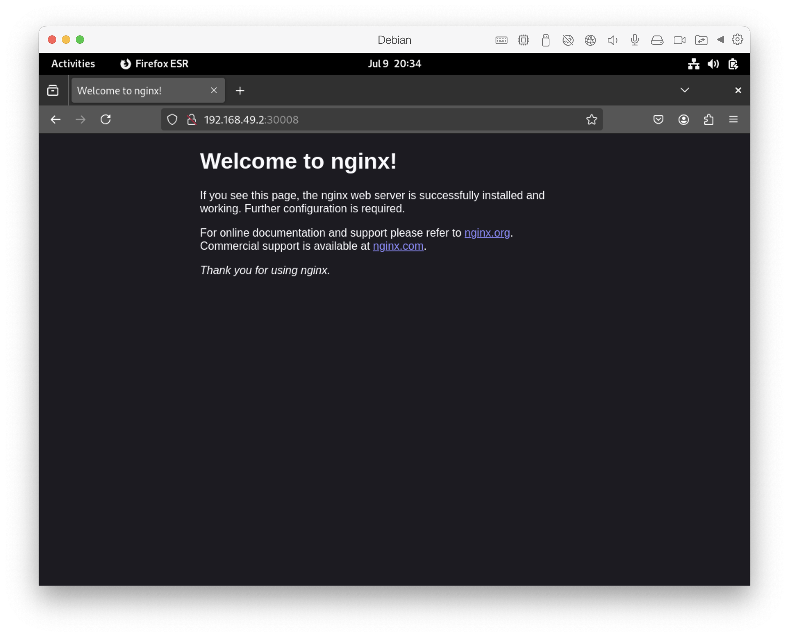

# `kubectl`

### To find number of pods available in `default` namespace using `kubectl get pods`

```
tecnomen@debian12:~/k8s/pod-demo-1$ kubectl get pods
No resources found in default namespace.
tecnomen@debian12:~/k8s/pod-demo-1$ 
```

### To find which node a pod is running using `kubectl get pods -o wide`

```
tecnomen@debian12:~/k8s/pod-demo-1$ 
tecnomen@debian12:~/k8s/pod-demo-1$ kubectl get pods -o wide
NAME    READY   STATUS    RESTARTS   AGE    IP           NODE       NOMINATED NODE   READINESS GATES
nginx   1/1     Running   0          106s   10.244.0.6   minikube   <none>           <none>
tecnomen@debian12:~/k8s/pod-demo-1$ 
tecnomen@debian12:~/k8s/pod-demo-1$ 
```

### To create a pod using `kubectl run`

```
tecnomen@debian12:~$ 
tecnomen@debian12:~$ kubectl run nginx --image nginx
pod/nginx created
tecnomen@debian12:~$ kubectl get pods
NAME    READY   STATUS              RESTARTS   AGE
nginx   0/1     ContainerCreating   0          6s
tecnomen@debian12:~$ 
tecnomen@debian12:~$ 
tecnomen@debian12:~$ kubectl get pods
NAME    READY   STATUS              RESTARTS   AGE
nginx   0/1     ContainerCreating   0          9s
tecnomen@debian12:~$ 
tecnomen@debian12:~$ 
tecnomen@debian12:~$ kubectl get pods
NAME    READY   STATUS    RESTARTS   AGE
nginx   1/1     Running   0          12s
tecnomen@debian12:~$ 
tecnomen@debian12:~$ 
tecnomen@debian12:~$ 
tecnomen@debian12:~$ 
tecnomen@debian12:~$ kubectl describe pod nginx
Name:             nginx
Namespace:        default
Priority:         0
Service Account:  default
Node:             minikube/192.168.49.2
Start Time:       Tue, 08 Jul 2025 22:44:32 +0800
Labels:           run=nginx
Annotations:      <none>
Status:           Running
IP:               10.244.0.3
IPs:
  IP:  10.244.0.3
Containers:
  nginx:
    Container ID:   docker://57727f7704f2bb18d255bbed7007e1852d6ec47385962cb432398537cdf7adbb
    Image:          nginx
    Image ID:       docker-pullable://nginx@sha256:93230cd54060f497430c7a120e2347894846a81b6a5dd2110f7362c5423b4abc
    Port:           <none>
    Host Port:      <none>
    State:          Running
      Started:      Tue, 08 Jul 2025 22:44:44 +0800
    Ready:          True
    Restart Count:  0
    Environment:    <none>
    Mounts:
      /var/run/secrets/kubernetes.io/serviceaccount from kube-api-access-hk7fq (ro)
Conditions:
  Type                        Status
  PodReadyToStartContainers   True 
  Initialized                 True 
  Ready                       True 
  ContainersReady             True 
  PodScheduled                True 
Volumes:
  kube-api-access-hk7fq:
    Type:                    Projected (a volume that contains injected data from multiple sources)
    TokenExpirationSeconds:  3607
    ConfigMapName:           kube-root-ca.crt
    Optional:                false
    DownwardAPI:             true
QoS Class:                   BestEffort
Node-Selectors:              <none>
Tolerations:                 node.kubernetes.io/not-ready:NoExecute op=Exists for 300s
                             node.kubernetes.io/unreachable:NoExecute op=Exists for 300s
Events:
  Type    Reason     Age    From               Message
  ----    ------     ----   ----               -------
  Normal  Scheduled  2m59s  default-scheduler  Successfully assigned default/nginx to minikube
  Normal  Pulling    2m59s  kubelet            Pulling image "nginx"
  Normal  Pulled     2m47s  kubelet            Successfully pulled image "nginx" in 11.963s (11.963s including waiting). Image size: 197642500 bytes.
  Normal  Created    2m47s  kubelet            Created container: nginx
  Normal  Started    2m47s  kubelet            Started container nginx
tecnomen@debian12:~$ 
tecnomen@debian12:~$ 
tecnomen@debian12:~$ 
tecnomen@debian12:~$ kubectl get pods -o wide
NAME    READY   STATUS    RESTARTS   AGE     IP           NODE       NOMINATED NODE   READINESS GATES
nginx   1/1     Running   0          5m21s   10.244.0.3   minikube   <none>           <none>
tecnomen@debian12:~$ 
tecnomen@debian12:~$ 
tecnomen@debian12:~$ 
tecnomen@debian12:~$ 
```

### To delete a pod using `kubectl delete pod`

```
tecnomen@debian12:~/k8s/pod-demo-1$ 
tecnomen@debian12:~/k8s/pod-demo-1$ kubectl get pods
NAME    READY   STATUS    RESTARTS   AGE
nginx   1/1     Running   0          7s
tecnomen@debian12:~/k8s/pod-demo-1$ 
tecnomen@debian12:~/k8s/pod-demo-1$ 
tecnomen@debian12:~/k8s/pod-demo-1$ kubectl delete pod nginx
pod "nginx" deleted
tecnomen@debian12:~/k8s/pod-demo-1$ 
tecnomen@debian12:~/k8s/pod-demo-1$ 
tecnomen@debian12:~/k8s/pod-demo-1$ 
tecnomen@debian12:~/k8s/pod-demo-1$ kubectl get pods
No resources found in default namespace.
tecnomen@debian12:~/k8s/pod-demo-1$ 
tecnomen@debian12:~/k8s/pod-demo-1$ 
tecnomen@debian12:~/k8s/pod-demo-1$ 
```

### To find details of a pod using `kubectl describe pod`

```
tecnomen@debian12:~/k8s/pod-demo-1$ kubectl describe pod nginx
Name:             nginx
Namespace:        default
Priority:         0
Service Account:  default
Node:             minikube/192.168.49.2
Start Time:       Wed, 09 Jul 2025 04:48:52 +0800
Labels:           run=nginx
Annotations:      <none>
Status:           Running
IP:               10.244.0.6
IPs:
  IP:  10.244.0.6
Containers:
  nginx:
    Container ID:   docker://d44a5124481c9bec287a2c447b94ba0303db7fbb2070b9172e400d75685133d3
    Image:          nginx
    Image ID:       docker-pullable://nginx@sha256:93230cd54060f497430c7a120e2347894846a81b6a5dd2110f7362c5423b4abc
    Port:           <none>
    Host Port:      <none>
    State:          Running
      Started:      Wed, 09 Jul 2025 04:48:56 +0800
    Ready:          True
    Restart Count:  0
    Environment:    <none>
    Mounts:
      /var/run/secrets/kubernetes.io/serviceaccount from kube-api-access-jbltk (ro)
Conditions:
  Type                        Status
  PodReadyToStartContainers   True 
  Initialized                 True 
  Ready                       True 
  ContainersReady             True 
  PodScheduled                True 
Volumes:
  kube-api-access-jbltk:
    Type:                    Projected (a volume that contains injected data from multiple sources)
    TokenExpirationSeconds:  3607
    ConfigMapName:           kube-root-ca.crt
    Optional:                false
    DownwardAPI:             true
QoS Class:                   BestEffort
Node-Selectors:              <none>
Tolerations:                 node.kubernetes.io/not-ready:NoExecute op=Exists for 300s
                             node.kubernetes.io/unreachable:NoExecute op=Exists for 300s
Events:
  Type    Reason     Age   From               Message
  ----    ------     ----  ----               -------
  Normal  Scheduled  9s    default-scheduler  Successfully assigned default/nginx to minikube
  Normal  Pulling    8s    kubelet            Pulling image "nginx"
  Normal  Pulled     6s    kubelet            Successfully pulled image "nginx" in 2.751s (2.751s including waiting). Image size: 197642500 bytes.
  Normal  Created    5s    kubelet            Created container: nginx
  Normal  Started    5s    kubelet            Started container nginx
tecnomen@debian12:~/k8s/pod-demo-1$ 
```

### To create a pod using `kubectl apply`

```
tecnomen@debian12:~/k8s/pod-demo-1$ cat pod.yaml 
apiVersion: v1
kind: Pod
metadata:
  name: nginx
  labels:
    app: nginx
    tier: frontend
spec:
  containers:
    - name: nginx
      image: nginx
tecnomen@debian12:~/k8s/pod-demo-1$ kubectl get pods
No resources found in default namespace.
tecnomen@debian12:~/k8s/pod-demo-1$ 
tecnomen@debian12:~/k8s/pod-demo-1$ kubectl apply -f pod.yaml 
pod/nginx created
tecnomen@debian12:~/k8s/pod-demo-1$ 
tecnomen@debian12:~/k8s/pod-demo-1$ 
tecnomen@debian12:~/k8s/pod-demo-1$ kubectl get pods
NAME    READY   STATUS              RESTARTS   AGE
nginx   0/1     ContainerCreating   0          3s
tecnomen@debian12:~/k8s/pod-demo-1$ kubectl get pods
NAME    READY   STATUS    RESTARTS   AGE
nginx   1/1     Running   0          4s
tecnomen@debian12:~/k8s/pod-demo-1$ kubectl describe pod nginx
Name:             nginx
Namespace:        default
Priority:         0
Service Account:  default
Node:             minikube/192.168.49.2
Start Time:       Wed, 09 Jul 2025 04:22:14 +0800
Labels:           app=nginx
                  tier=frontend
Annotations:      <none>
Status:           Running
IP:               10.244.0.4
IPs:
  IP:  10.244.0.4
Containers:
  nginx:
    Container ID:   docker://fa3a1bac60d4504c13431eac61e969f698b6445b3cbb17e670a5c52e55e8089e
    Image:          nginx
    Image ID:       docker-pullable://nginx@sha256:93230cd54060f497430c7a120e2347894846a81b6a5dd2110f7362c5423b4abc
    Port:           <none>
    Host Port:      <none>
    State:          Running
      Started:      Wed, 09 Jul 2025 04:22:17 +0800
    Ready:          True
    Restart Count:  0
    Environment:    <none>
    Mounts:
      /var/run/secrets/kubernetes.io/serviceaccount from kube-api-access-2864v (ro)
Conditions:
  Type                        Status
  PodReadyToStartContainers   True 
  Initialized                 True 
  Ready                       True 
  ContainersReady             True 
  PodScheduled                True 
Volumes:
  kube-api-access-2864v:
    Type:                    Projected (a volume that contains injected data from multiple sources)
    TokenExpirationSeconds:  3607
    ConfigMapName:           kube-root-ca.crt
    Optional:                false
    DownwardAPI:             true
QoS Class:                   BestEffort
Node-Selectors:              <none>
Tolerations:                 node.kubernetes.io/not-ready:NoExecute op=Exists for 300s
                             node.kubernetes.io/unreachable:NoExecute op=Exists for 300s
Events:
  Type    Reason     Age   From               Message
  ----    ------     ----  ----               -------
  Normal  Scheduled  16s   default-scheduler  Successfully assigned default/nginx to minikube
  Normal  Pulling    15s   kubelet            Pulling image "nginx"
  Normal  Pulled     13s   kubelet            Successfully pulled image "nginx" in 2.705s (2.705s including waiting). Image size: 197642500 bytes.
  Normal  Created    13s   kubelet            Created container: nginx
  Normal  Started    13s   kubelet            Started container nginx
tecnomen@debian12:~/k8s/pod-demo-1$ 
tecnomen@debian12:~/k8s/pod-demo-1$ 
tecnomen@debian12:~/k8s/pod-demo-1$ 
tecnomen@debian12:~/k8s/pod-demo-1$ kubectl delete pod nginx
pod "nginx" deleted
tecnomen@debian12:~/k8s/pod-demo-1$ 
tecnomen@debian12:~/k8s/pod-demo-1$ 
tecnomen@debian12:~/k8s/pod-demo-1$ kubectl get pods
No resources found in default namespace.
tecnomen@debian12:~/k8s/pod-demo-1$ 
```

### To generata pod definition yaml file using `kubectl run` with `--dry-run=client -o yaml`

```
tecnomen@debian12:~/k8s/pod-demo-1$ kubectl run redis --image=redis-fake --dry-run=client -o yaml
apiVersion: v1
kind: Pod
metadata:
  creationTimestamp: null
  labels:
    run: redis
  name: redis
spec:
  containers:
  - image: redis-fake
    name: redis
    resources: {}
  dnsPolicy: ClusterFirst
  restartPolicy: Always
status: {}
tecnomen@debian12:~/k8s/pod-demo-1$ 
```

### To create replication controller using `kubectl create` with the replication controller definition file

```
tecnomen@debian12:~/k8s/replicasets-demo-1$ cat rc-definition.yaml 
apiVersion: v1
kind: ReplicationController
metadata:
  name: myapp-rc
  labels:
    app: myapp
    type: front-end
spec:
  template:
    metadata:
      name: myapp-pod
      labels:
        app: myapp
        type: front-end
    spec:
      containers:
        - name: nginx-container
          image: nginx
  replicas: 3
tecnomen@debian12:~/k8s/replicasets-demo-1$ 
tecnomen@debian12:~/k8s/replicasets-demo-1$ kubectl create -f rc-definition.yaml 
replicationcontroller/myapp-rc created
tecnomen@debian12:~/k8s/replicasets-demo-1$ 
tecnomen@debian12:~/k8s/replicasets-demo-1$ kubectl get pods
NAME             READY   STATUS              RESTARTS   AGE
myapp-rc-k2l77   1/1     Running             0          5s
myapp-rc-v9k2m   0/1     ContainerCreating   0          5s
myapp-rc-xljq8   0/1     ContainerCreating   0          5s
nginx            1/1     Running             0          4h42m
tecnomen@debian12:~/k8s/replicasets-demo-1$ 
tecnomen@debian12:~/k8s/replicasets-demo-1$ kubectl delete pod nginx
pod "nginx" deleted
tecnomen@debian12:~/k8s/replicasets-demo-1$ 
tecnomen@debian12:~/k8s/replicasets-demo-1$ 
tecnomen@debian12:~/k8s/replicasets-demo-1$ kubectl get pods
NAME             READY   STATUS    RESTARTS   AGE
myapp-rc-k2l77   1/1     Running   0          16s
myapp-rc-v9k2m   1/1     Running   0          16s
myapp-rc-xljq8   1/1     Running   0          16s
tecnomen@debian12:~/k8s/replicasets-demo-1$ 
tecnomen@debian12:~/k8s/replicasets-demo-1$ 
tecnomen@debian12:~/k8s/replicasets-demo-1$ kubectl get replicationcontroller
NAME       DESIRED   CURRENT   READY   AGE
myapp-rc   3         3         3       56s
tecnomen@debian12:~/k8s/replicasets-demo-1$ 
tecnomen@debian12:~/k8s/replicasets-demo-1$ 
```

### To delete replication controller with `kubectl delete replicationcontroller`

```
tecnomen@debian12:~/k8s/replica-set-demo-1$ 
tecnomen@debian12:~/k8s/replica-set-demo-1$ kubectl get replicationcontroller
NAME       DESIRED   CURRENT   READY   AGE
myapp-rc   3         3         3       21m
tecnomen@debian12:~/k8s/replica-set-demo-1$ 
tecnomen@debian12:~/k8s/replica-set-demo-1$ kubectl delete replicationcontroller myapp-rc
replicationcontroller "myapp-rc" deleted
tecnomen@debian12:~/k8s/replica-set-demo-1$ 
tecnomen@debian12:~/k8s/replica-set-demo-1$ 
tecnomen@debian12:~/k8s/replica-set-demo-1$ kubectl get replicationcontroller
No resources found in default namespace.
tecnomen@debian12:~/k8s/replica-set-demo-1$ 
tecnomen@debian12:~/k8s/replica-set-demo-1$ 
tecnomen@debian12:~/k8s/replica-set-demo-1$ kubectl get pods
No resources found in default namespace.
tecnomen@debian12:~/k8s/replica-set-demo-1$ 
tecnomen@debian12:~/k8s/replica-set-demo-1$ 
```

### To create replicaset using `kubectl create` with the replicaset definition file

```
tecnomen@debian12:~/k8s/replicat-set-demo-1$ cat replicaset-definition.yml 
apiVersion: apps/v1
kind: ReplicaSet
metadata:
  name: myapp-replicaset
  labels:
    app: myapp
    type: front-end
spec:
  template:
    metadata:
      name: myapp-pod
      labels:
        app: myapp
        type: front-end
    spec:
      containers:
        - name: nginx-container
          image: nginx
  replicas: 3
  selector:
    matchLabels:
      type: front-end
tecnomen@debian12:~/k8s/replicat-set-demo-1$ 
tecnomen@debian12:~/k8s/replicat-set-demo-1$ kubectl create -f replicaset-definition.yml 
replicaset.apps/myapp-replicaset created
tecnomen@debian12:~/k8s/replicat-set-demo-1$ 
tecnomen@debian12:~/k8s/replicat-set-demo-1$ 
tecnomen@debian12:~/k8s/replicat-set-demo-1$ kubectl get replicaset
NAME               DESIRED   CURRENT   READY   AGE
myapp-replicaset   3         3         2       7s
tecnomen@debian12:~/k8s/replicat-set-demo-1$ 
tecnomen@debian12:~/k8s/replicat-set-demo-1$ 
tecnomen@debian12:~/k8s/replicat-set-demo-1$ 
tecnomen@debian12:~/k8s/replicat-set-demo-1$ kubectl get pods
NAME                     READY   STATUS    RESTARTS   AGE
myapp-rc-k2l77           1/1     Running   0          9m27s
myapp-rc-v9k2m           1/1     Running   0          9m27s
myapp-rc-xljq8           1/1     Running   0          9m27s
myapp-replicaset-2l88v   1/1     Running   0          12s
myapp-replicaset-bbvhz   1/1     Running   0          12s
myapp-replicaset-zn6hd   1/1     Running   0          12s
tecnomen@debian12:~/k8s/replicat-set-demo-1$ 
tecnomen@debian12:~/k8s/replicat-set-demo-1$ 
tecnomen@debian12:~/k8s/replicat-set-demo-1$ 
```

### To scale replicaset up or down using `kubectl`

```
tecnomen@debian12:~/k8s$ cd replica-set-demo-1/
tecnomen@debian12:~/k8s/replica-set-demo-1$ cat replicaset-definition.yml 
apiVersion: apps/v1
kind: ReplicaSet
metadata:
  name: myapp-replicaset
  labels:
    app: myapp
    type: front-end
spec:
  template:
    metadata:
      name: myapp-pod
      labels:
        app: myapp
        type: front-end
    spec:
      containers:
        - name: nginx-container
          image: nginx
  replicas: 3
  selector:
    matchLabels:
      type: front-end
tecnomen@debian12:~/k8s/replica-set-demo-1$ 
tecnomen@debian12:~/k8s/replica-set-demo-1$ vi replicaset-definition.yml 
tecnomen@debian12:~/k8s/replica-set-demo-1$ 
tecnomen@debian12:~/k8s/replica-set-demo-1$ cat replicaset-definition.yml 
apiVersion: apps/v1
kind: ReplicaSet
metadata:
  name: myapp-replicaset
  labels:
    app: myapp
    type: front-end
spec:
  template:
    metadata:
      name: myapp-pod
      labels:
        app: myapp
        type: front-end
    spec:
      containers:
        - name: nginx-container
          image: nginx
  replicas: 6
  selector:
    matchLabels:
      type: front-end
tecnomen@debian12:~/k8s/replica-set-demo-1$ 
tecnomen@debian12:~/k8s/replica-set-demo-1$ 
tecnomen@debian12:~/k8s/replica-set-demo-1$ kubectl get replicaset
NAME               DESIRED   CURRENT   READY   AGE
myapp-replicaset   3         3         3       6m16s
tecnomen@debian12:~/k8s/replica-set-demo-1$ 
tecnomen@debian12:~/k8s/replica-set-demo-1$ 
tecnomen@debian12:~/k8s/replica-set-demo-1$ kubectl create -f replicaset-definition.yml 
Error from server (AlreadyExists): error when creating "replicaset-definition.yml": replicasets.apps "myapp-replicaset" already exists
tecnomen@debian12:~/k8s/replica-set-demo-1$ 
tecnomen@debian12:~/k8s/replica-set-demo-1$ kubectl scale --replicas=6 -f replicaset-definition.yml 
replicaset.apps/myapp-replicaset scaled
tecnomen@debian12:~/k8s/replica-set-demo-1$ 
tecnomen@debian12:~/k8s/replica-set-demo-1$ kubectl get replicaset
NAME               DESIRED   CURRENT   READY   AGE
myapp-replicaset   6         6         3       6m39s
tecnomen@debian12:~/k8s/replica-set-demo-1$ 
tecnomen@debian12:~/k8s/replica-set-demo-1$ 
tecnomen@debian12:~/k8s/replica-set-demo-1$ kubectl get replicaset
NAME               DESIRED   CURRENT   READY   AGE
myapp-replicaset   6         6         5       6m43s
tecnomen@debian12:~/k8s/replica-set-demo-1$ 
tecnomen@debian12:~/k8s/replica-set-demo-1$ kubectl get replicaset
NAME               DESIRED   CURRENT   READY   AGE
myapp-replicaset   6         6         6       8m12s
tecnomen@debian12:~/k8s/replica-set-demo-1$ 
tecnomen@debian12:~/k8s/replica-set-demo-1$ cat replicaset-definition.yml 
apiVersion: apps/v1
kind: ReplicaSet
metadata:
  name: myapp-replicaset
  labels:
    app: myapp
    type: front-end
spec:
  template:
    metadata:
      name: myapp-pod
      labels:
        app: myapp
        type: front-end
    spec:
      containers:
        - name: nginx-container
          image: nginx
  replicas: 6
  selector:
    matchLabels:
      type: front-end
tecnomen@debian12:~/k8s/replica-set-demo-1$ 
tecnomen@debian12:~/k8s/replica-set-demo-1$ vi replicaset-definition.yml 
tecnomen@debian12:~/k8s/replica-set-demo-1$ 
tecnomen@debian12:~/k8s/replica-set-demo-1$ 
tecnomen@debian12:~/k8s/replica-set-demo-1$ kubectl replace -f replicaset-definition.yml 
replicaset.apps/myapp-replicaset replaced
tecnomen@debian12:~/k8s/replica-set-demo-1$ 
tecnomen@debian12:~/k8s/replica-set-demo-1$ 
tecnomen@debian12:~/k8s/replica-set-demo-1$ kubectl get replicaset
NAME               DESIRED   CURRENT   READY   AGE
myapp-replicaset   2         2         2       8m41s
tecnomen@debian12:~/k8s/replica-set-demo-1$ 
tecnomen@debian12:~/k8s/replica-set-demo-1$ 
tecnomen@debian12:~/k8s/replica-set-demo-1$ kubectl get pods
NAME                     READY   STATUS    RESTARTS   AGE
myapp-rc-k2l77           1/1     Running   0          18m
myapp-rc-v9k2m           1/1     Running   0          18m
myapp-rc-xljq8           1/1     Running   0          18m
myapp-replicaset-2l88v   1/1     Running   0          8m49s
myapp-replicaset-bbvhz   1/1     Running   0          8m49s
tecnomen@debian12:~/k8s/replica-set-demo-1$ 
tecnomen@debian12:~/k8s/replica-set-demo-1$ 
```

### Scale replicaset with `kubectl edit replicaset` or `kubectl scale replicaset`

```
tecnomen@debian12:~/k8s/replica-set-demo-1$ cat replicaset-definition.yml 
apiVersion: apps/v1
kind: ReplicaSet
metadata:
  name: myapp-replicaset
  labels:
    app: myapp
    type: front-end
spec:
  template:
    metadata:
      name: myapp-pod
      labels:
        app: myapp
        type: front-end
    spec:
      containers:
        - name: nginx-container
          image: nginx
  replicas: 2
  selector:
    matchLabels:
      type: front-end
tecnomen@debian12:~/k8s/replica-set-demo-1$ 
tecnomen@debian12:~/k8s/replica-set-demo-1$ kubectl get pods
NAME                     READY   STATUS    RESTARTS   AGE
myapp-replicaset-jqq2p   1/1     Running   0          29m
myapp-replicaset-q2nth   1/1     Running   0          28m
tecnomen@debian12:~/k8s/replica-set-demo-1$ 
tecnomen@debian12:~/k8s/replica-set-demo-1$ 
tecnomen@debian12:~/k8s/replica-set-demo-1$ kubectl edit replicaset myapp-replicaset
replicaset.apps/myapp-replicaset edited
tecnomen@debian12:~/k8s/replica-set-demo-1$ 
tecnomen@debian12:~/k8s/replica-set-demo-1$ kubectl get pods
NAME                     READY   STATUS              RESTARTS   AGE
myapp-replicaset-jk89f   0/1     ContainerCreating   0          3s
myapp-replicaset-jqq2p   1/1     Running             0          30m
myapp-replicaset-q2nth   1/1     Running             0          29m
tecnomen@debian12:~/k8s/replica-set-demo-1$ 
tecnomen@debian12:~/k8s/replica-set-demo-1$ kubectl get replicaset
NAME               DESIRED   CURRENT   READY   AGE
myapp-replicaset   3         3         3       30m
tecnomen@debian12:~/k8s/replica-set-demo-1$ 
tecnomen@debian12:~/k8s/replica-set-demo-1$ 
tecnomen@debian12:~/k8s/replica-set-demo-1$ 
tecnomen@debian12:~/k8s/replica-set-demo-1$ 
tecnomen@debian12:~/k8s/replica-set-demo-1$ 
tecnomen@debian12:~/k8s/replica-set-demo-1$ 
tecnomen@debian12:~/k8s/replica-set-demo-1$ 
tecnomen@debian12:~/k8s/replica-set-demo-1$ kubectl get pods
NAME                     READY   STATUS    RESTARTS   AGE
myapp-replicaset-jk89f   1/1     Running   0          4h53m
myapp-replicaset-jqq2p   1/1     Running   0          5h23m
myapp-replicaset-q2nth   1/1     Running   0          5h22m
tecnomen@debian12:~/k8s/replica-set-demo-1$ 
tecnomen@debian12:~/k8s/replica-set-demo-1$ 
tecnomen@debian12:~/k8s/replica-set-demo-1$ kubectl scale replicaset myapp-replicaset --replicas=2
replicaset.apps/myapp-replicaset scaled
tecnomen@debian12:~/k8s/replica-set-demo-1$ 
tecnomen@debian12:~/k8s/replica-set-demo-1$ 
tecnomen@debian12:~/k8s/replica-set-demo-1$ kubectl get pods
NAME                     READY   STATUS    RESTARTS   AGE
myapp-replicaset-jk89f   1/1     Running   0          4h53m
myapp-replicaset-jqq2p   1/1     Running   0          5h23m
tecnomen@debian12:~/k8s/replica-set-demo-1$ 
```

### Delete replicaset with `kubectl delete replicaset`

```
tecnomen@debian12:~/k8s/replica-set-demo-1$ kubectl get replicaset
NAME               DESIRED   CURRENT   READY   AGE
myapp-replicaset   2         2         2       10m
tecnomen@debian12:~/k8s/replica-set-demo-1$ 
tecnomen@debian12:~/k8s/replica-set-demo-1$ kubectl delete replicaset myapp-replicaset
replicaset.apps "myapp-replicaset" deleted
tecnomen@debian12:~/k8s/replica-set-demo-1$ 
tecnomen@debian12:~/k8s/replica-set-demo-1$ kubectl get replicaset
No resources found in default namespace.
tecnomen@debian12:~/k8s/replica-set-demo-1$ 
tecnomen@debian12:~/k8s/replica-set-demo-1$ kubectl get pods
NAME             READY   STATUS    RESTARTS   AGE
myapp-rc-k2l77   1/1     Running   0          20m
myapp-rc-v9k2m   1/1     Running   0          20m
myapp-rc-xljq8   1/1     Running   0          20m
tecnomen@debian12:~/k8s/replica-set-demo-1$ 

tecnomen@debian12:~/k8s/replica-set-demo-1$ 
tecnomen@debian12:~/k8s/replica-set-demo-1$ kubectl get pods
NAME                     READY   STATUS    RESTARTS   AGE
myapp-replicaset-jk89f   1/1     Running   0          5h11m
myapp-replicaset-jqq2p   1/1     Running   0          5h41m
tecnomen@debian12:~/k8s/replica-set-demo-1$ 
tecnomen@debian12:~/k8s/replica-set-demo-1$ 
tecnomen@debian12:~/k8s/replica-set-demo-1$ kubectl delete rs myapp-replicaset
replicaset.apps "myapp-replicaset" deleted
tecnomen@debian12:~/k8s/replica-set-demo-1$ 
tecnomen@debian12:~/k8s/replica-set-demo-1$ kubectl get pods
No resources found in default namespace.
tecnomen@debian12:~/k8s/replica-set-demo-1$ 
tecnomen@debian12:~/k8s/replica-set-demo-1$ 
tecnomen@debian12:~/k8s/replica-set-demo-1$ kubectl get rs
No resources found in default namespace.
tecnomen@debian12:~/k8s/replica-set-demo-1$ 
tecnomen@debian12:~/k8s/replica-set-demo-1$ 
```

### Using `kubectl explain` command

```
tecnomen@debian12:~/k8s/replica-set-demo-1$ 
tecnomen@debian12:~/k8s/replica-set-demo-1$ 
tecnomen@debian12:~/k8s/replica-set-demo-1$ kubectl get replicaset
NAME               DESIRED   CURRENT   READY   AGE
myapp-replicaset   2         2         2       5h32m
tecnomen@debian12:~/k8s/replica-set-demo-1$ 
tecnomen@debian12:~/k8s/replica-set-demo-1$ kubectl explain replicaset
GROUP:      apps
KIND:       ReplicaSet
VERSION:    v1

DESCRIPTION:
    ReplicaSet ensures that a specified number of pod replicas are running at
    any given time.
    
FIELDS:
  apiVersion  <string>
    APIVersion defines the versioned schema of this representation of an object.
    Servers should convert recognized schemas to the latest internal value, and
    may reject unrecognized values. More info:
    https://git.k8s.io/community/contributors/devel/sig-architecture/api-conventions.md#resources

  kind  <string>
    Kind is a string value representing the REST resource this object
    represents. Servers may infer this from the endpoint the client submits
    requests to. Cannot be updated. In CamelCase. More info:
    https://git.k8s.io/community/contributors/devel/sig-architecture/api-conventions.md#types-kinds

  metadata  <ObjectMeta>
    If the Labels of a ReplicaSet are empty, they are defaulted to be the same
    as the Pod(s) that the ReplicaSet manages. Standard object's metadata. More
    info:
    https://git.k8s.io/community/contributors/devel/sig-architecture/api-conventions.md#metadata

  spec  <ReplicaSetSpec>
    Spec defines the specification of the desired behavior of the ReplicaSet.
    More info:
    https://git.k8s.io/community/contributors/devel/sig-architecture/api-conventions.md#spec-and-status

  status  <ReplicaSetStatus>
    Status is the most recently observed status of the ReplicaSet. This data may
    be out of date by some window of time. Populated by the system. Read-only.
    More info:
    https://git.k8s.io/community/contributors/devel/sig-architecture/api-conventions.md#spec-and-status


tecnomen@debian12:~/k8s/replica-set-demo-1$ 
```

### Create deployment using `kubectl create`

```
tecnomen@debian12:~/k8s/deployment-demo$ cat deployment-definition.yml 
apiVersion: apps/v1
kind: Deployment
metadata:
  name: myapp-replicaset
  labels:
    app: myapp
    type: front-end
spec:
  template:
    metadata:
      name: myapp-pod
      labels:
        app: myapp
        type: front-end
    spec:
      containers:
        - name: nginx-container
          image: nginx
  replicas: 3
  selector:
    matchLabels:
      type: front-end
tecnomen@debian12:~/k8s/deployment-demo$ 
tecnomen@debian12:~/k8s/deployment-demo$ kubectl get pods
No resources found in default namespace.
tecnomen@debian12:~/k8s/deployment-demo$ 
tecnomen@debian12:~/k8s/deployment-demo$ kubectl create -f deployment-definition.yml 
deployment.apps/myapp-replicaset created
tecnomen@debian12:~/k8s/deployment-demo$ 
tecnomen@debian12:~/k8s/deployment-demo$ kubectl get deployments
NAME               READY   UP-TO-DATE   AVAILABLE   AGE
myapp-replicaset   1/3     3            1           5s
tecnomen@debian12:~/k8s/deployment-demo$ 
tecnomen@debian12:~/k8s/deployment-demo$ kubectl get deployments
NAME               READY   UP-TO-DATE   AVAILABLE   AGE
myapp-replicaset   3/3     3            3           9s
tecnomen@debian12:~/k8s/deployment-demo$ kubectl get pods
NAME                                READY   STATUS    RESTARTS   AGE
myapp-replicaset-56db76d944-b52kq   1/1     Running   0          12s
myapp-replicaset-56db76d944-mxsgx   1/1     Running   0          12s
myapp-replicaset-56db76d944-zwl2p   1/1     Running   0          12s
tecnomen@debian12:~/k8s/deployment-demo$ 
tecnomen@debian12:~/k8s/deployment-demo$ 
tecnomen@debian12:~/k8s/deployment-demo$ kubectl get rs
NAME                          DESIRED   CURRENT   READY   AGE
myapp-replicaset-56db76d944   3         3         3       15s
tecnomen@debian12:~/k8s/deployment-demo$ 
tecnomen@debian12:~/k8s/deployment-demo$ 
tecnomen@debian12:~/k8s/deployment-demo$ 
```

### Get all objects using `kubectl get all`

```
tecnomen@debian12:~/k8s/deployment-demo$ 
tecnomen@debian12:~/k8s/deployment-demo$ kubectl get all
NAME                                    READY   STATUS    RESTARTS   AGE
pod/myapp-replicaset-56db76d944-b52kq   1/1     Running   0          50s
pod/myapp-replicaset-56db76d944-mxsgx   1/1     Running   0          50s
pod/myapp-replicaset-56db76d944-zwl2p   1/1     Running   0          50s

NAME                 TYPE        CLUSTER-IP   EXTERNAL-IP   PORT(S)   AGE
service/kubernetes   ClusterIP   10.96.0.1    <none>        443/TCP   18h

NAME                               READY   UP-TO-DATE   AVAILABLE   AGE
deployment.apps/myapp-replicaset   3/3     3            3           50s

NAME                                          DESIRED   CURRENT   READY   AGE
replicaset.apps/myapp-replicaset-56db76d944   3         3         3       50s
tecnomen@debian12:~/k8s/deployment-demo$ 
```

### Describe deployment with `kubectl describe deployments`

```
tecnomen@debian12:~/k8s/deployment-demo$ cat deployment-definition.yml 
apiVersion: apps/v1
kind: Deployment
metadata:
  name: myapp-deployment
  labels:
    app: myapp
    type: front-end
spec:
  template:
    metadata:
      name: myapp-pod
      labels:
        app: myapp
        type: front-end
    spec:
      containers:
        - name: nginx-container
          image: nginx
  replicas: 3
  selector:
    matchLabels:
      type: front-end
tecnomen@debian12:~/k8s/deployment-demo$ 
tecnomen@debian12:~/k8s/deployment-demo$ 
tecnomen@debian12:~/k8s/deployment-demo$ kubectl create -f deployment-definition.yml 
deployment.apps/myapp-deployment created
tecnomen@debian12:~/k8s/deployment-demo$ 
tecnomen@debian12:~/k8s/deployment-demo$ 
tecnomen@debian12:~/k8s/deployment-demo$ kubectl get pods
NAME                                READY   STATUS              RESTARTS   AGE
myapp-deployment-56db76d944-l8cfh   1/1     Running             0          5s
myapp-deployment-56db76d944-qm5tm   0/1     ContainerCreating   0          5s
myapp-deployment-56db76d944-tkhmk   0/1     ContainerCreating   0          5s
tecnomen@debian12:~/k8s/deployment-demo$ 
tecnomen@debian12:~/k8s/deployment-demo$ kubectl get deployments
NAME               READY   UP-TO-DATE   AVAILABLE   AGE
myapp-deployment   3/3     3            3           12s
tecnomen@debian12:~/k8s/deployment-demo$ 
tecnomen@debian12:~/k8s/deployment-demo$ 
tecnomen@debian12:~/k8s/deployment-demo$ kubectl describe deployments myapp-deployment
Name:                   myapp-deployment
Namespace:              default
CreationTimestamp:      Wed, 09 Jul 2025 16:01:48 +0800
Labels:                 app=myapp
                        type=front-end
Annotations:            deployment.kubernetes.io/revision: 1
Selector:               type=front-end
Replicas:               3 desired | 3 updated | 3 total | 3 available | 0 unavailable
StrategyType:           RollingUpdate
MinReadySeconds:        0
RollingUpdateStrategy:  25% max unavailable, 25% max surge
Pod Template:
  Labels:  app=myapp
           type=front-end
  Containers:
   nginx-container:
    Image:         nginx
    Port:          <none>
    Host Port:     <none>
    Environment:   <none>
    Mounts:        <none>
  Volumes:         <none>
  Node-Selectors:  <none>
  Tolerations:     <none>
Conditions:
  Type           Status  Reason
  ----           ------  ------
  Available      True    MinimumReplicasAvailable
  Progressing    True    NewReplicaSetAvailable
OldReplicaSets:  <none>
NewReplicaSet:   myapp-deployment-56db76d944 (3/3 replicas created)
Events:
  Type    Reason             Age   From                   Message
  ----    ------             ----  ----                   -------
  Normal  ScalingReplicaSet  21s   deployment-controller  Scaled up replica set myapp-deployment-56db76d944 from 0 to 3
tecnomen@debian12:~/k8s/deployment-demo$ 
tecnomen@debian12:~/k8s/deployment-demo$ 

tecnomen@debian12:~/k8s/deployment-demo$ kubectl describe deployment myapp-deployment
Name:                   myapp-deployment
Namespace:              default
CreationTimestamp:      Wed, 09 Jul 2025 16:01:48 +0800
Labels:                 app=myapp
                        type=front-end
Annotations:            deployment.kubernetes.io/revision: 1
Selector:               type=front-end
Replicas:               3 desired | 3 updated | 3 total | 3 available | 0 unavailable
StrategyType:           RollingUpdate
MinReadySeconds:        0
RollingUpdateStrategy:  25% max unavailable, 25% max surge
Pod Template:
  Labels:  app=myapp
           type=front-end
  Containers:
   nginx-container:
    Image:         nginx
    Port:          <none>
    Host Port:     <none>
    Environment:   <none>
    Mounts:        <none>
  Volumes:         <none>
  Node-Selectors:  <none>
  Tolerations:     <none>
Conditions:
  Type           Status  Reason
  ----           ------  ------
  Available      True    MinimumReplicasAvailable
  Progressing    True    NewReplicaSetAvailable
OldReplicaSets:  <none>
NewReplicaSet:   myapp-deployment-56db76d944 (3/3 replicas created)
Events:
  Type    Reason             Age   From                   Message
  ----    ------             ----  ----                   -------
  Normal  ScalingReplicaSet  52s   deployment-controller  Scaled up replica set myapp-deployment-56db76d944 from 0 to 3
tecnomen@debian12:~/k8s/deployment-demo$ 
tecnomen@debian12:~/k8s/deployment-demo$ kubectl describe deploy myapp-deployment
Name:                   myapp-deployment
Namespace:              default
CreationTimestamp:      Wed, 09 Jul 2025 16:01:48 +0800
Labels:                 app=myapp
                        type=front-end
Annotations:            deployment.kubernetes.io/revision: 1
Selector:               type=front-end
Replicas:               3 desired | 3 updated | 3 total | 3 available | 0 unavailable
StrategyType:           RollingUpdate
MinReadySeconds:        0
RollingUpdateStrategy:  25% max unavailable, 25% max surge
Pod Template:
  Labels:  app=myapp
           type=front-end
  Containers:
   nginx-container:
    Image:         nginx
    Port:          <none>
    Host Port:     <none>
    Environment:   <none>
    Mounts:        <none>
  Volumes:         <none>
  Node-Selectors:  <none>
  Tolerations:     <none>
Conditions:
  Type           Status  Reason
  ----           ------  ------
  Available      True    MinimumReplicasAvailable
  Progressing    True    NewReplicaSetAvailable
OldReplicaSets:  <none>
NewReplicaSet:   myapp-deployment-56db76d944 (3/3 replicas created)
Events:
  Type    Reason             Age   From                   Message
  ----    ------             ----  ----                   -------
  Normal  ScalingReplicaSet  59s   deployment-controller  Scaled up replica set myapp-deployment-56db76d944 from 0 to 3
tecnomen@debian12:~/k8s/deployment-demo$
```

### Delete deployment with `kubectl delete deployment`

```
tecnomen@debian12:~/k8s/deployment-demo$ kubectl get all
NAME                                    READY   STATUS    RESTARTS   AGE
pod/myapp-deployment-56db76d944-l8cfh   1/1     Running   0          87s
pod/myapp-deployment-56db76d944-qm5tm   1/1     Running   0          87s
pod/myapp-deployment-56db76d944-tkhmk   1/1     Running   0          87s

NAME                 TYPE        CLUSTER-IP   EXTERNAL-IP   PORT(S)   AGE
service/kubernetes   ClusterIP   10.96.0.1    <none>        443/TCP   18h

NAME                               READY   UP-TO-DATE   AVAILABLE   AGE
deployment.apps/myapp-deployment   3/3     3            3           87s

NAME                                          DESIRED   CURRENT   READY   AGE
replicaset.apps/myapp-deployment-56db76d944   3         3         3       87s
tecnomen@debian12:~/k8s/deployment-demo$ 
tecnomen@debian12:~/k8s/deployment-demo$ 
tecnomen@debian12:~/k8s/deployment-demo$ kubectl delete deployment myapp-deployment
deployment.apps "myapp-deployment" deleted
tecnomen@debian12:~/k8s/deployment-demo$ 
tecnomen@debian12:~/k8s/deployment-demo$ 
tecnomen@debian12:~/k8s/deployment-demo$ kubectl get all
NAME                 TYPE        CLUSTER-IP   EXTERNAL-IP   PORT(S)   AGE
service/kubernetes   ClusterIP   10.96.0.1    <none>        443/TCP   18h
tecnomen@debian12:~/k8s/deployment-demo$ kubectl get all
NAME                 TYPE        CLUSTER-IP   EXTERNAL-IP   PORT(S)   AGE
service/kubernetes   ClusterIP   10.96.0.1    <none>        443/TCP   18h
tecnomen@debian12:~/k8s/deployment-demo$ 
tecnomen@debian12:~/k8s/deployment-demo$ kubectl get pods
No resources found in default namespace.
tecnomen@debian12:~/k8s/deployment-demo$ 
tecnomen@debian12:~/k8s/deployment-demo$ 
tecnomen@debian12:~/k8s/deployment-demo$ kubectl get deployment
No resources found in default namespace.
tecnomen@debian12:~/k8s/deployment-demo$ 
tecnomen@debian12:~/k8s/deployment-demo$ 
```

### Check rollout status with `kubectl rollout status`

```
tecnomen@debian12:~/k8s/deployment-demo$ kubectl get deployment
NAME               READY   UP-TO-DATE   AVAILABLE   AGE
myapp-deployment   1/3     3            1           6s
tecnomen@debian12:~/k8s/deployment-demo$ 
tecnomen@debian12:~/k8s/deployment-demo$ kubectl rollout status deployment/myapp-deployment
deployment "myapp-deployment" successfully rolled out
tecnomen@debian12:~/k8s/deployment-demo$ 
tecnomen@debian12:~/k8s/deployment-demo$ 
tecnomen@debian12:~/k8s/deployment-demo$ kubectl rollout history deployment/myapp-deployment
deployment.apps/myapp-deployment 
REVISION  CHANGE-CAUSE
1         <none>

tecnomen@debian12:~/k8s/deployment-demo$ 


```

### Undo rollout with `kubectl rollout undo`

```
tecnomen@debian12:~/k8s/deployment-demo$ cat deployment-definition.yml 
apiVersion: apps/v1
kind: Deployment
metadata:
  name: myapp-deployment
  labels:
    app: myapp
    type: front-end
spec:
  template:
    metadata:
      name: myapp-pod
      labels:
        app: myapp
        type: front-end
    spec:
      containers:
        - name: nginx-container
          image: nginx
  replicas: 3
  selector:
    matchLabels:
      type: front-end
tecnomen@debian12:~/k8s/deployment-demo$ 
tecnomen@debian12:~/k8s/deployment-demo$ vi deployment-definition.yml 
tecnomen@debian12:~/k8s/deployment-demo$ cat deployment-definition.yml 
apiVersion: apps/v1
kind: Deployment
metadata:
  name: myapp-deployment
  labels:
    app: myapp
    type: front-end
spec:
  template:
    metadata:
      name: myapp-pod
      labels:
        app: myapp
        type: front-end
    spec:
      containers:
        - name: nginx-container
          image: nginx: 1.7.1
  replicas: 3
  selector:
    matchLabels:
      type: front-end
tecnomen@debian12:~/k8s/deployment-demo$ 
tecnomen@debian12:~/k8s/deployment-demo$ 
tecnomen@debian12:~/k8s/deployment-demo$ vi deployment-definition.yml 
tecnomen@debian12:~/k8s/deployment-demo$ kubectl apply -f deployment-definition.yml 
Warning: resource deployments/myapp-deployment is missing the kubectl.kubernetes.io/last-applied-configuration annotation which is required by kubectl apply. kubectl apply should only be used on resources created declaratively by either kubectl create --save-config or kubectl apply. The missing annotation will be patched automatically.
deployment.apps/myapp-deployment configured
tecnomen@debian12:~/k8s/deployment-demo$ 
tecnomen@debian12:~/k8s/deployment-demo$ kubectl rollout history deployment/myapp-deployment
deployment.apps/myapp-deployment 
REVISION  CHANGE-CAUSE
1         <none>
2         <none>

tecnomen@debian12:~/k8s/deployment-demo$ 
tecnomen@debian12:~/k8s/deployment-demo$ kubectl rollout undo deployment/myapp-deployment
deployment.apps/myapp-deployment rolled back
tecnomen@debian12:~/k8s/deployment-demo$ 
tecnomen@debian12:~/k8s/deployment-demo$ kubectl get rs
NAME                          DESIRED   CURRENT   READY   AGE
myapp-deployment-56db76d944   3         3         3       7m55s
myapp-deployment-759ddb7df7   0         0         0       4m7s
tecnomen@debian12:~/k8s/deployment-demo$ 
```

### Rollout history with `kubectl rollout history`

```
tecnomen@debian12:~/k8s/deployment-demo$ 
tecnomen@debian12:~/k8s/deployment-demo$ 
tecnomen@debian12:~/k8s/deployment-demo$ kubectl get deployment
No resources found in default namespace.
tecnomen@debian12:~/k8s/deployment-demo$ kubectl create -f deployment-definition.yml --record
Flag --record has been deprecated, --record will be removed in the future
deployment.apps/myapp-deployment created
tecnomen@debian12:~/k8s/deployment-demo$ kubectl rollout status deployment/myapp-deployment
Waiting for deployment "myapp-deployment" rollout to finish: 0 of 3 updated replicas are available...
Waiting for deployment "myapp-deployment" rollout to finish: 1 of 3 updated replicas are available...
Waiting for deployment "myapp-deployment" rollout to finish: 2 of 3 updated replicas are available...
deployment "myapp-deployment" successfully rolled out
tecnomen@debian12:~/k8s/deployment-demo$ 
tecnomen@debian12:~/k8s/deployment-demo$ kubectl rollout history deployment/myapp-deployment
deployment.apps/myapp-deployment 
REVISION  CHANGE-CAUSE
1         kubectl create --filename=deployment-definition.yml --record=true

tecnomen@debian12:~/k8s/deployment-demo$ 
tecnomen@debian12:~/k8s/deployment-demo$ kubectl get rs
NAME                          DESIRED   CURRENT   READY   AGE
myapp-deployment-5cbcd58577   3         3         3       71s
tecnomen@debian12:~/k8s/deployment-demo$ 
tecnomen@debian12:~/k8s/deployment-demo$ cat deployment-definition.yml 
apiVersion: apps/v1
kind: Deployment
metadata:
  name: myapp-deployment
  labels:
    app: myapp
    type: front-end
spec:
  template:
    metadata:
      name: myapp-pod
      labels:
        app: myapp
        type: front-end
    spec:
      containers:
        - name: nginx-container
          image: nginx:1.28
  replicas: 3
  selector:
    matchLabels:
      type: front-end
tecnomen@debian12:~/k8s/deployment-demo$ 
tecnomen@debian12:~/k8s/deployment-demo$ vi deployment-definition.yml 
tecnomen@debian12:~/k8s/deployment-demo$ 
tecnomen@debian12:~/k8s/deployment-demo$ cat deployment-definition.yml 
apiVersion: apps/v1
kind: Deployment
metadata:
  name: myapp-deployment
  labels:
    app: myapp
    type: front-end
spec:
  template:
    metadata:
      name: myapp-pod
      labels:
        app: myapp
        type: front-end
    spec:
      containers:
        - name: nginx-container
          image: nginx:1.29
  replicas: 3
  selector:
    matchLabels:
      type: front-end
tecnomen@debian12:~/k8s/deployment-demo$ 
tecnomen@debian12:~/k8s/deployment-demo$ kubectl apply -f deployment-definition.yml 
Warning: resource deployments/myapp-deployment is missing the kubectl.kubernetes.io/last-applied-configuration annotation which is required by kubectl apply. kubectl apply should only be used on resources created declaratively by either kubectl create --save-config or kubectl apply. The missing annotation will be patched automatically.
deployment.apps/myapp-deployment configured
tecnomen@debian12:~/k8s/deployment-demo$ 
tecnomen@debian12:~/k8s/deployment-demo$ kubectl get rs
NAME                          DESIRED   CURRENT   READY   AGE
myapp-deployment-5cbcd58577   2         2         2       114s
myapp-deployment-6b98d674f6   2         2         1       4s
tecnomen@debian12:~/k8s/deployment-demo$ 
tecnomen@debian12:~/k8s/deployment-demo$ kubectl rollout status deployment/myapp-deployment
deployment "myapp-deployment" successfully rolled out
tecnomen@debian12:~/k8s/deployment-demo$ kubectl rollout history deployment/myapp-deployment
deployment.apps/myapp-deployment 
REVISION  CHANGE-CAUSE
1         kubectl create --filename=deployment-definition.yml --record=true
2         kubectl create --filename=deployment-definition.yml --record=true

tecnomen@debian12:~/k8s/deployment-demo$ 
tecnomen@debian12:~/k8s/deployment-demo$ kubectl set image deployment/my-deployment nginx-container=nginx:1.29-bookworm
Error from server (NotFound): deployments.apps "my-deployment" not found
tecnomen@debian12:~/k8s/deployment-demo$ kubectl set image deployment/myapp-deployment nginx-container=nginx:1.29-bookworm
deployment.apps/myapp-deployment image updated
tecnomen@debian12:~/k8s/deployment-demo$ 
tecnomen@debian12:~/k8s/deployment-demo$ kubectl rollout history deployment/myapp-deployment
deployment.apps/myapp-deployment 
REVISION  CHANGE-CAUSE
1         kubectl create --filename=deployment-definition.yml --record=true
2         kubectl create --filename=deployment-definition.yml --record=true
3         kubectl create --filename=deployment-definition.yml --record=true

tecnomen@debian12:~/k8s/deployment-demo$ 
tecnomen@debian12:~/k8s/deployment-demo$ kubectl rollout undo deployment/myapp-deployment
deployment.apps/myapp-deployment rolled back
tecnomen@debian12:~/k8s/deployment-demo$ kubectl rollout history deployment/myapp-deployment
deployment.apps/myapp-deployment 
REVISION  CHANGE-CAUSE
1         kubectl create --filename=deployment-definition.yml --record=true
3         kubectl create --filename=deployment-definition.yml --record=true
4         kubectl create --filename=deployment-definition.yml --record=true

tecnomen@debian12:~/k8s/deployment-demo$ kubectl describe deployment/myapp-deployment
Name:                   myapp-deployment
Namespace:              default
CreationTimestamp:      Wed, 09 Jul 2025 17:36:21 +0800
Labels:                 app=myapp
                        type=front-end
Annotations:            deployment.kubernetes.io/revision: 4
                        kubernetes.io/change-cause: kubectl create --filename=deployment-definition.yml --record=true
Selector:               type=front-end
Replicas:               3 desired | 3 updated | 3 total | 3 available | 0 unavailable
StrategyType:           RollingUpdate
MinReadySeconds:        0
RollingUpdateStrategy:  25% max unavailable, 25% max surge
Pod Template:
  Labels:  app=myapp
           type=front-end
  Containers:
   nginx-container:
    Image:         nginx:1.29
    Port:          <none>
    Host Port:     <none>
    Environment:   <none>
    Mounts:        <none>
  Volumes:         <none>
  Node-Selectors:  <none>
  Tolerations:     <none>
Conditions:
  Type           Status  Reason
  ----           ------  ------
  Available      True    MinimumReplicasAvailable
  Progressing    True    NewReplicaSetAvailable
OldReplicaSets:  myapp-deployment-5cbcd58577 (0/0 replicas created), myapp-deployment-5cbb54979c (0/0 replicas created)
NewReplicaSet:   myapp-deployment-6b98d674f6 (3/3 replicas created)
Events:
  Type    Reason             Age                  From                   Message
  ----    ------             ----                 ----                   -------
  Normal  ScalingReplicaSet  6m10s                deployment-controller  Scaled up replica set myapp-deployment-5cbcd58577 from 0 to 3
  Normal  ScalingReplicaSet  4m20s                deployment-controller  Scaled up replica set myapp-deployment-6b98d674f6 from 0 to 1
  Normal  ScalingReplicaSet  4m16s                deployment-controller  Scaled down replica set myapp-deployment-5cbcd58577 from 3 to 2
  Normal  ScalingReplicaSet  4m15s                deployment-controller  Scaled down replica set myapp-deployment-5cbcd58577 from 2 to 1
  Normal  ScalingReplicaSet  4m15s                deployment-controller  Scaled up replica set myapp-deployment-6b98d674f6 from 2 to 3
  Normal  ScalingReplicaSet  4m14s                deployment-controller  Scaled down replica set myapp-deployment-5cbcd58577 from 1 to 0
  Normal  ScalingReplicaSet  2m38s                deployment-controller  Scaled up replica set myapp-deployment-5cbb54979c from 0 to 1
  Normal  ScalingReplicaSet  2m33s                deployment-controller  Scaled down replica set myapp-deployment-6b98d674f6 from 3 to 2
  Normal  ScalingReplicaSet  68s (x2 over 4m16s)  deployment-controller  Scaled up replica set myapp-deployment-6b98d674f6 from 1 to 2
  Normal  ScalingReplicaSet  66s (x9 over 2m33s)  deployment-controller  (combined from similar events): Scaled down replica set myapp-deployment-5cbb54979c from 1 to 0
tecnomen@debian12:~/k8s/deployment-demo$
```

### To deploy service using `kubectl create`

> Note that in below, the pod are running and with the matching labels in the selector field.

> Note that by right we should run the `minikube service myapp-service` inside the Debian vm, so that we won't see the locale error.

```
tecnomen@debian12:~/k8s/service-demo-1$ cat service-definition.yml 
apiVersion: v1
kind: Service
metadata:
  name: myapp-service

spec:
  type: NodePort
  ports:
    - targetPort: 80
      port: 80
      nodePort: 30008
  selector:
    app: myapp
    type: front-end
tecnomen@debian12:~/k8s/service-demo-1$ kubectl get pods
NAME                                READY   STATUS    RESTARTS   AGE
myapp-deployment-6b98d674f6-8ntfh   1/1     Running   0          165m
myapp-deployment-6b98d674f6-b2dlf   1/1     Running   0          165m
myapp-deployment-6b98d674f6-tzqh9   1/1     Running   0          165m
tecnomen@debian12:~/k8s/service-demo-1$ 
tecnomen@debian12:~/k8s/service-demo-1$ 
tecnomen@debian12:~/k8s/service-demo-1$ kubectl create -f service-definition.yml --record=true
Flag --record has been deprecated, --record will be removed in the future
service/myapp-service created
tecnomen@debian12:~/k8s/service-demo-1$ 
tecnomen@debian12:~/k8s/service-demo-1$ kubectl get service
NAME            TYPE        CLUSTER-IP     EXTERNAL-IP   PORT(S)        AGE
kubernetes      ClusterIP   10.96.0.1      <none>        443/TCP        23h
myapp-service   NodePort    10.98.55.253   <none>        80:30008/TCP   6s
tecnomen@debian12:~/k8s/service-demo-1$ 
tecnomen@debian12:~/k8s/service-demo-1$ 
tecnomen@debian12:~/k8s/service-demo-1$ kubectl get all
NAME                                    READY   STATUS    RESTARTS   AGE
pod/myapp-deployment-6b98d674f6-8ntfh   1/1     Running   0          165m
pod/myapp-deployment-6b98d674f6-b2dlf   1/1     Running   0          165m
pod/myapp-deployment-6b98d674f6-tzqh9   1/1     Running   0          165m

NAME                    TYPE        CLUSTER-IP     EXTERNAL-IP   PORT(S)        AGE
service/kubernetes      ClusterIP   10.96.0.1      <none>        443/TCP        23h
service/myapp-service   NodePort    10.98.55.253   <none>        80:30008/TCP   17s

NAME                               READY   UP-TO-DATE   AVAILABLE   AGE
deployment.apps/myapp-deployment   3/3     3            3           170m

NAME                                          DESIRED   CURRENT   READY   AGE
replicaset.apps/myapp-deployment-5cbb54979c   0         0         0       167m
replicaset.apps/myapp-deployment-5cbcd58577   0         0         0       170m
replicaset.apps/myapp-deployment-6b98d674f6   3         3         3       168m
tecnomen@debian12:~/k8s/service-demo-1$ 
tecnomen@debian12:~/k8s/service-demo-1$ minikube service myapp-service
|-----------|---------------|-------------|---------------------------|
| NAMESPACE |     NAME      | TARGET PORT |            URL            |
|-----------|---------------|-------------|---------------------------|
| default   | myapp-service |          80 | http://192.168.49.2:30008 |
|-----------|---------------|-------------|---------------------------|
🎉  Opening service default/myapp-service in default browser...
tecnomen@debian12:~/k8s/service-demo-1$ [541029, Main Thread] WARNING: Locale not supported by C library.
  Using the fallback 'C' locale.: 'glib warning', file ./toolkit/xre/nsSigHandlers.cpp:187

(firefox-esr:541029): Gtk-WARNING **: 20:27:42.747: Locale not supported by C library.
  Using the fallback 'C' locale.
Error: no DISPLAY environment variable specified
^C
tecnomen@debian12:~/k8s/service-demo-1$ minikube service myapp-service
|-----------|---------------|-------------|---------------------------|
| NAMESPACE |     NAME      | TARGET PORT |            URL            |
|-----------|---------------|-------------|---------------------------|
| default   | myapp-service |          80 | http://192.168.49.2:30008 |
|-----------|---------------|-------------|---------------------------|
🎉  Opening service default/myapp-service in default browser...
tecnomen@debian12:~/k8s/service-demo-1$ [541350, Main Thread] WARNING: Locale not supported by C library.
  Using the fallback 'C' locale.: 'glib warning', file ./toolkit/xre/nsSigHandlers.cpp:187

(firefox-esr:541350): Gtk-WARNING **: 20:28:19.249: Locale not supported by C library.
  Using the fallback 'C' locale.
Error: no DISPLAY environment variable specified
^C
tecnomen@debian12:~/k8s/service-demo-1$ cat ../deployment-demo-1/deployment-definition.yml 
apiVersion: apps/v1
kind: Deployment
metadata:
  name: myapp-deployment
  labels:
    app: myapp
    type: front-end
spec:
  template:
    metadata:
      name: myapp-pod
      labels:
        app: myapp
        type: front-end
    spec:
      containers:
        - name: nginx-container
          image: nginx:1.29
  replicas: 3
  selector:
    matchLabels:
      type: front-end
tecnomen@debian12:~/k8s/service-demo-1$ 
tecnomen@debian12:~/k8s/service-demo-1$ kubectl get service
NAME            TYPE        CLUSTER-IP     EXTERNAL-IP   PORT(S)        AGE
kubernetes      ClusterIP   10.96.0.1      <none>        443/TCP        23h
myapp-service   NodePort    10.98.55.253   <none>        80:30008/TCP   22m
tecnomen@debian12:~/k8s/service-demo-1$ 
```


### Creating service using cluster IP

```
[mbp2022@~/Study/Kubernetes/yaml 13:49:07:174] mkctl get pods
No resources found in default namespace.
[mbp2022@~/Study/Kubernetes/yaml 13:49:17:174] 
[mbp2022@~/Study/Kubernetes/yaml 13:49:17:174] 
[mbp2022@~/Study/Kubernetes/yaml 13:49:18:174] mkctl create -f clusterip-pod-definition.yaml     
pod/myapp-pod created
[mbp2022@~/Study/Kubernetes/yaml 13:49:28:174] 
[mbp2022@~/Study/Kubernetes/yaml 13:49:29:174] mkctl get pods                               
NAME        READY   STATUS              RESTARTS   AGE
myapp-pod   0/1     ContainerCreating   0          2s
[mbp2022@~/Study/Kubernetes/yaml 13:49:30:174] 
[mbp2022@~/Study/Kubernetes/yaml 13:49:30:174] 
[mbp2022@~/Study/Kubernetes/yaml 13:49:31:174] 
[mbp2022@~/Study/Kubernetes/yaml 13:49:31:174] mkctl create -f clusterip-service-definition.yaml 
service/back-end created
[mbp2022@~/Study/Kubernetes/yaml 13:49:44:174] 
[mbp2022@~/Study/Kubernetes/yaml 13:49:44:174] 
[mbp2022@~/Study/Kubernetes/yaml 13:49:44:174] mkctl get service
NAME         TYPE        CLUSTER-IP       EXTERNAL-IP   PORT(S)   AGE
back-end     ClusterIP   10.101.180.142   <none>        80/TCP    4s
kubernetes   ClusterIP   10.96.0.1        <none>        443/TCP   36m
[mbp2022@~/Study/Kubernetes/yaml 13:49:48:174] 
[mbp2022@~/Study/Kubernetes/yaml 13:50:02:174] cat clusterip-pod-definition.yaml 
apiVersion: v1
kind: Pod
metadata:
  name: myapp-pod
  labels:
    app: myapp
    type: back-end

spec:
  containers:
    - name: nginx-container
      image: nginx%                                                                                                                                                                                                                                  [mbp2022@~/Study/Kubernetes/yaml 13:50:04:174] 
[mbp2022@~/Study/Kubernetes/yaml 13:50:05:174] 
[mbp2022@~/Study/Kubernetes/yaml 13:50:05:174] cat clusterip-service-definition.yaml 
apiVersion: v1
kind: Service
metadata:
  name: back-end

spec:
  type: ClusterIP
  ports:
    - targetPort: 80
      port: 80
  selector:
    app: myapp
    type: back-end%                                                                                                                                                                                                                                  [mbp2022@~/Study/Kubernetes/yaml 13:50:09:174] 
```